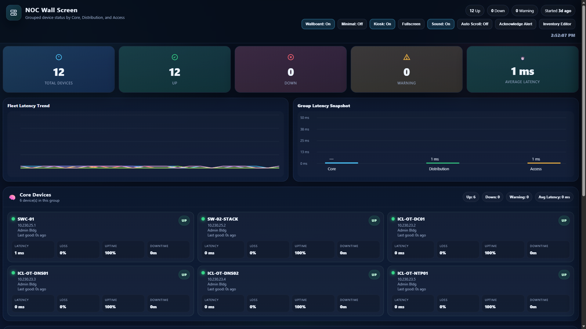
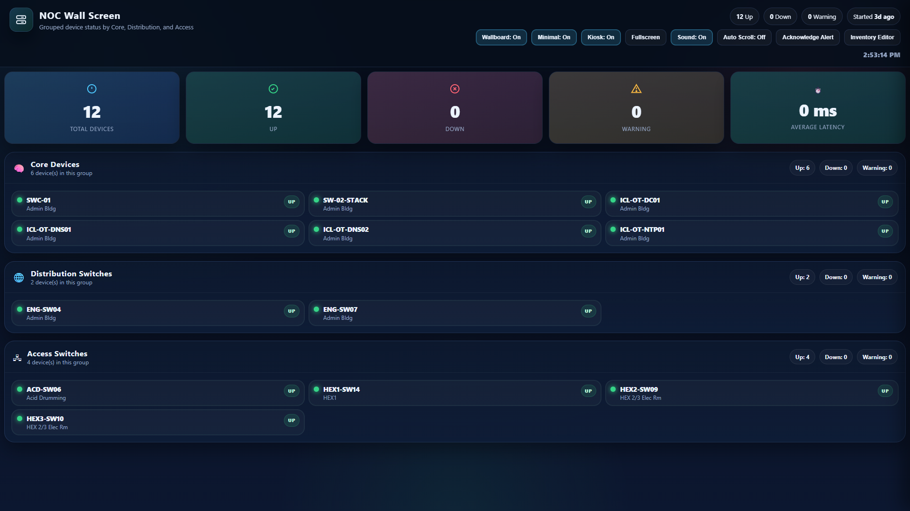
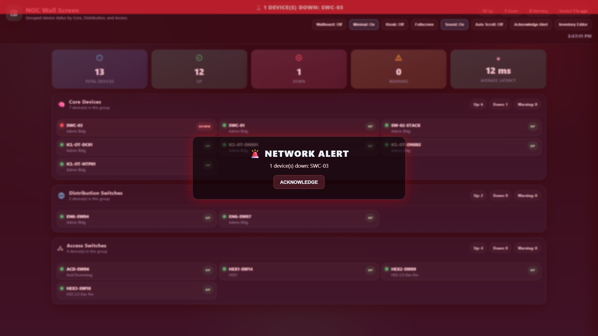

# NOC Pinger

A lightweight PowerShell-based Network Operations Center monitor that continuously pings a list of devices, tracks uptime and latency statistics, logs status changes, exposes live JSON API endpoints, and serves a local web dashboard from the same folder.

## What This Script Does

`noc-pinger.ps1` starts a local HTTP server and monitors network devices defined in `devices.json`. Each configured device is checked at a recurring interval using ICMP ping. The script tracks whether devices are up, warning, or down, calculates latency and availability statistics, writes event history to CSV, and exposes the current monitor state through API endpoints that can be consumed by a dashboard UI.

The script also supports hot-reloading the device inventory. When `devices.json` changes, the running monitor reloads the inventory without needing to restart the script.

## Features

- Continuously pings devices on a configurable interval
- Tracks device status as `unknown`, `up`, `warning`, or `down`
- Uses a configurable failure threshold before declaring a device down
- Records latency statistics including last, average, minimum, and maximum latency
- Calculates uptime percentage and packet loss percentage
- Tracks downtime duration after recovery
- Keeps per-device recent event history
- Writes event logs to `events.csv`
- Serves a local web dashboard using PowerShell's built-in HTTP listener
- Provides JSON API endpoints for dashboard or external tooling
- Supports editing the device inventory through the `/api/devices` endpoint
- Hot-reloads `devices.json` when the file changes
- Can optionally launch the dashboard automatically in a browser

## Screenshots

> Add your screenshots to a `screenshots` folder in the repository, then replace these placeholders as needed.

### Wall Fullscreen



### Wall Fullscreen Minimal



### Wall Fullscreen Minimal Alert



## Requirements

- Windows PowerShell 5.1 or PowerShell 7+
- Network access to the monitored devices
- ICMP/ping allowed between the monitoring host and targets
- A valid `devices.json` file in the script folder, unless another path is provided
- Optional dashboard files such as `index.html`, CSS, JavaScript, icons, and sounds in the same folder as the script

> **Note:** The script uses `System.Net.HttpListener`. Binding to certain addresses or ports may require running PowerShell as Administrator or creating a Windows URL ACL reservation.

## File Layout

Recommended folder structure:

```text
NOC-Pinger/
├── noc-pinger.ps1
├── devices.json
├── index.html
├── style.css
├── app.js
├── alarm1.mp3
└── noc-data/
    └── events.csv
```

The `noc-data` folder and `events.csv` file are created automatically if they do not already exist.

## Device Inventory Format

The script expects a JSON file with a top-level `devices` array.

Example `devices.json`:

```json
{
  "devices": [
    {
      "ip": "10.10.10.1",
      "hostname": "CORE-SW01",
      "group": "core",
      "location": "Main MDF",
      "notes": "Primary core switch"
    },
    {
      "ip": "10.10.20.10",
      "hostname": "ACCESS-SW01",
      "group": "access",
      "location": "Building A IDF",
      "notes": "First floor access switch"
    }
  ]
}
```

### Supported Device Fields

| Field | Required | Description |
|---|---:|---|
| `ip` | Yes | IP address to ping. Must be a valid IP address. |
| `hostname` | Yes | Friendly display name for the device. Defaults to the IP if omitted. |
| `group` | No | Device group. Must be `core`, `distribution`, or `access`. Defaults to `access`. |
| `location` | No | Physical or logical location. Defaults to `Unknown`. |
| `notes` | No | Optional notes about the device. |

Invalid devices are skipped and logged. If no valid devices are found, the script stops with an error.

## Usage

Run from PowerShell:

```powershell
.\noc-pinger.ps1
```

By default, the dashboard listens on:

```text
http://localhost:8085/
```

To stop the monitor, press `Ctrl+C` in the PowerShell window.

## Common Examples

Run on the default port and open the browser automatically:

```powershell
.\noc-pinger.ps1
```

Run without opening a browser:

```powershell
.\noc-pinger.ps1 -NoBrowser
```

Listen on all interfaces so another system or reverse proxy can reach it:

```powershell
.\noc-pinger.ps1 -BindAddress "*" -Port 8085
```

Use a custom device file and data directory:

```powershell
.\noc-pinger.ps1 -DevicesFile ".\config\devices.json" -DataPath ".\data"
```

Ping every 10 seconds with a 2-second timeout:

```powershell
.\noc-pinger.ps1 -PingIntervalSeconds 10 -TimeoutMs 2000
```

Require 3 failed checks before a device is declared down:

```powershell
.\noc-pinger.ps1 -FailureThreshold 3
```

## Script Parameters

| Parameter | Default | Description |
|---|---:|---|
| `BindAddress` | `localhost` | Address the HTTP listener binds to. Use `*` to listen on all interfaces. |
| `Port` | `8085` | HTTP port used by the dashboard and API. |
| `PingIntervalSeconds` | `5` | Number of seconds between ping checks. |
| `TimeoutMs` | `1000` | Ping timeout in milliseconds. |
| `FailureThreshold` | `2` | Number of consecutive failed pings required before marking a device down. |
| `MaxHistory` | `60` | Number of recent ping history records kept per device. |
| `MaxLogs` | `500` | Number of in-memory log entries retained. |
| `DevicesFile` | `.\devices.json` | Device inventory file path, relative to the script folder. |
| `DataPath` | `.\noc-data` | Folder where event logs are stored. |
| `NoBrowser` | Disabled | Prevents the script from launching the dashboard in a browser. |

## Status Logic

| Status | Meaning |
|---|---|
| `unknown` | Initial state before checks complete. |
| `up` | Device responded successfully to ping. |
| `warning` | One or more ping checks failed, but the failure threshold has not been reached. |
| `down` | The device failed enough consecutive checks to meet or exceed the configured failure threshold. |

When a device recovers from a warning or down state, the script records a recovery event and updates downtime totals.

## API Endpoints

The built-in HTTP server exposes the following endpoints.

### `GET /api/state`

Returns the full live monitor state, including settings, devices, current status, latency statistics, uptime statistics, recent logs, and config status.

Example:

```powershell
Invoke-RestMethod http://localhost:8085/api/state
```

### `GET /api/devices`

Returns the current device inventory in JSON format.

Example:

```powershell
Invoke-RestMethod http://localhost:8085/api/devices
```

### `PUT /api/devices`

Updates `devices.json` with a new device inventory. The payload must contain a top-level `devices` array.

Example:

```powershell
$payload = @{
    devices = @(
        @{
            ip       = "10.10.10.1"
            hostname = "CORE-SW01"
            group    = "core"
            location = "Main MDF"
            notes    = "Primary core switch"
        }
    )
} | ConvertTo-Json -Depth 5

Invoke-RestMethod `
    -Uri http://localhost:8085/api/devices `
    -Method Put `
    -ContentType "application/json" `
    -Body $payload
```

## Static File Hosting

The script serves static files from the same folder as `noc-pinger.ps1`.

When the root URL `/` is requested, the script serves:

```text
index.html
```

Supported static content types include:

- HTML
- CSS
- JavaScript
- JSON
- MP3
- SVG
- PNG
- JPG/JPEG
- ICO

This allows the dashboard frontend to be hosted directly by the PowerShell script.

## Logging

Events are written to:

```text
.\noc-data\events.csv
```

CSV columns:

| Column | Description |
|---|---|
| `Timestamp` | Event timestamp in ISO 8601 format. |
| `Level` | Event level: `INFO`, `WARN`, or `ERROR`. |
| `Target` | Device IP address or system target such as `config` or `api`. |
| `Message` | Event message. |

The script also keeps recent log entries in memory and exposes them through `/api/state`.

## URL ACL / Permission Troubleshooting

If PowerShell cannot start the HTTP listener, run PowerShell as Administrator or create a URL ACL reservation.

Example for port `8085`:

```powershell
netsh http add urlacl url=http://+:8085/ user=Everyone
```

To remove the reservation later:

```powershell
netsh http delete urlacl url=http://+:8085/
```

## Reverse Proxy Notes

To place the dashboard behind a reverse proxy, run the script so it listens on an address the proxy can reach.

Example:

```powershell
.\noc-pinger.ps1 -BindAddress "*" -Port 8085 -NoBrowser
```

Then configure the reverse proxy to forward traffic to:

```text
http://SERVER-IP:8085/
```

## Security Notes

This script does not include authentication or authorization. Do not expose it directly to the public internet unless it is protected by a reverse proxy, VPN, firewall rule, access control layer, or other security control.

The `/api/devices` `PUT` endpoint can update the monitored inventory, so access to the web interface should be restricted to trusted users.

## License

Add your preferred license before publishing to GitHub.
